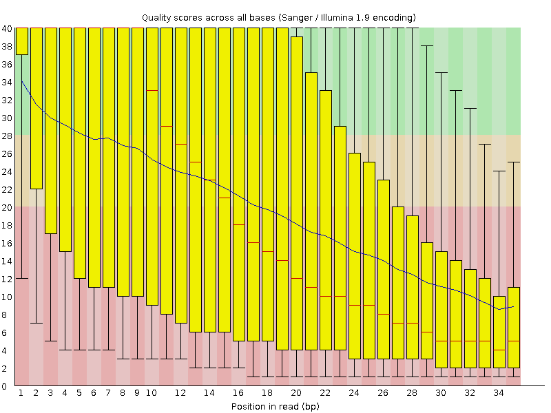
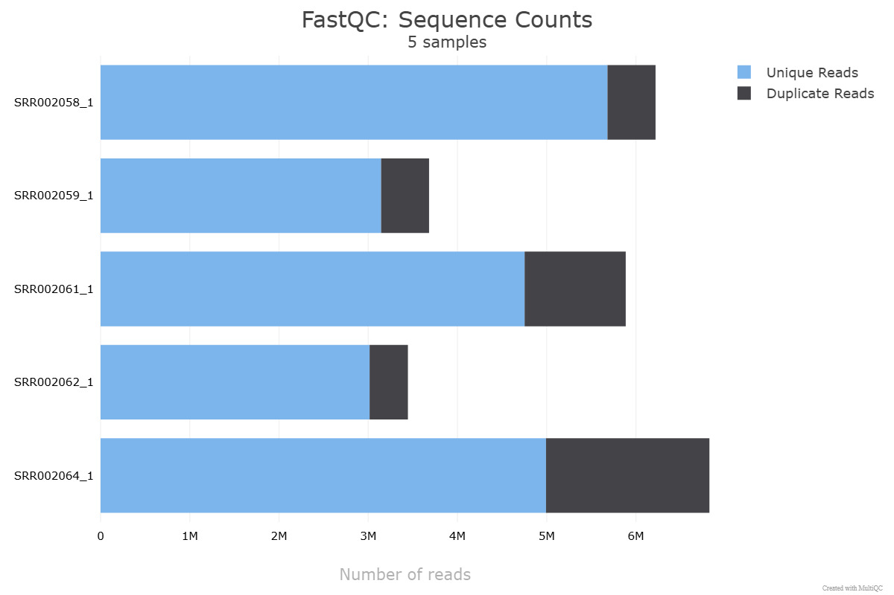

# RNA-Seq Analysis of Yeast (GSE11209) using Python
This repository contains the complete RNA-seq analysis pipeline for Saccharomyces cerevisiae (yeast) using the dataset GSE11209. The analysis involves downloading raw RNA-seq FASTQ files, building a genome index, performing quality control (QC), trimming, and aligning the reads to the genome. Below is an overview of each step in the process.
## Overview
1. **Data Acquisition**: Raw RNA-seq FASTQ files are downloaded using the **Entrez** library and the **SRA Toolkit**. Genome and annotation files (R64-1-1 version) are downloaded from Ensembl Fungi for the construction of a genome index.
2. **Building the Genome Index**: The genome FASTA file and GTF annotation file are used to build a genome index using **STAR** aligner for efficient and accurate alignment of the RNA-seq reads to the yeast genome.
3. **Quality Control**: Quality control of raw FASTQ files is performed using **FastQC** and reports are summarized using **MultiQC**.
4. **Read Trimming**: Reads are trimmed using **Trim Galore** to remove low-quality bases and adapter sequences from the RNA-seq reads and stored in a separate directory.
5. **Read Alignment**: Trimmed reads are aligned to the yeast genome using **STAR** aligner.
## Pipeline Workflow
1. **Download Raw Data**:
   - Use the Entrez API to retrieve **GSE**, **GSM**, and **SRA** IDs for the raw RNA-seq data from NCBI databases.
   - Download the FASTQ files using the **SRA Toolkit**.
2. **Download Genome and Annotation Files**:
   - Download the **R64-1-1** genome FASTA file and the corresponding **GTF** annotation file from **Ensembl Fungi**.
3. **Build STAR Genome Index**:
   - Create a **STAR** genome index using the genome FASTA file and the annotation GTF file.
   - This index is required for alignment with STAR.
4. **Quality Control**:
   - Run **FastQC** on the raw FASTQ files to assess the quality of the sequencing data.
   - Summarize the results using **MultiQC**.
5. **Trim Reads**:
   - Use **Trim Galore** to trim adapter sequences and low-quality bases from the reads.
   - The trimmed reads are saved for downstream analysis.
6. **Align Reads**:
   - Use **STAR** aligner to align the trimmed reads to the yeast genome.
   - The output files are in **BAM** format, sorted by coordinate.
## Dependencies
To run the analysis, you will need the following tools and libraries:
- **Python 3.12** (version 3.12 or less for compatibility with trim-galore)
- **SRA Toolkit** (for downloading raw data)
- **FastQC** (for quality control)
- **MultiQC** (for summarizing QC reports)
- **Trim Galore** (for trimming)
- **STAR** (for read alignment)
You can install the required tools using **conda** or **pip**.
## Running the Analysis
1. Run the download_rna_seq_fastq.py script to download the RNA-seq data from SRA and
2. Run the build_genome_index.py script to download genome annotation files from Ensembl Fungi and build the genome index.
3.	Run the qc_align.py script to run FastQC, MultiQC, trim the reads, check the quality of trimmed reads, and align the reads with the built genome index.

Example of running the complete pipeline:
```
python download_rna_seq_fastq.py
python build_genome_index.py
python qc_align.py
```
## Notes
- You can skip the genome index building step if using a pre-built genome index.
- You can skip the trimming step if the data quality is good from the QC reports.
### Quality Control Reports Examples
**Per Base Sequence Quality for SRR002058_1 sample:**



**Unique and Duplicate Reads for all samples:**


## Next Steps
- Perform differential expression analysis using DESeq2.
- Visualize the results using Python.


